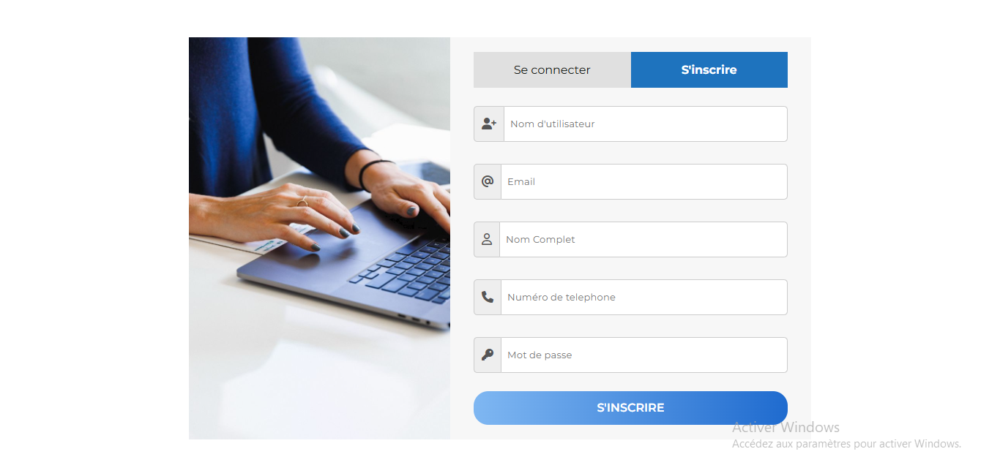

# web development assignment. Registration part

## Table of contents

- [Overview](#overview)
  - [The challenge](#the-challenge)
  - [Screenshot](#screenshot)
  - [Links](#links)
- [My process](#my-process)
  - [Built with](#built-with)
- [Author](#author)


## Overview

### The challenge

Users should be able to:

- View the optimal layout depending on their device's screen size
- See hover states for interactive elements

### Screenshot




### Links

- Live Site URL: [Add live site URL here](https://your-live-site-url.com)

## My process

### Built with

- Semantic HTML5 markup
- CSS custom properties
- Flexbox


### What I learned


```html
  <div>
      <i class="fa-solid fa-user-plus icon-visible"></i>
      <input type="text" placeholder="Nom d'utilisateur">
  </div>
```
```css
.elements .icon-visible{
    border: solid rgb(204,204,204) 1px;
    border-right: none;
    padding: 15.5px 10px;
    align-self: center;
    border-radius: 5px 0px 0px 5px;
    background-color: rgb(238,238,238);
    color: rgb(85,85,85);
}
```


## Author

- Frontend Mentor - [GraceAriane](https://www.frontendmentor.io/profile/GraceAriane)
- linkedIn - [Grace Ariane Tchoukeu](https://www.linkedin.com/in/grace-ariane-tchoukeu-a290b022a)